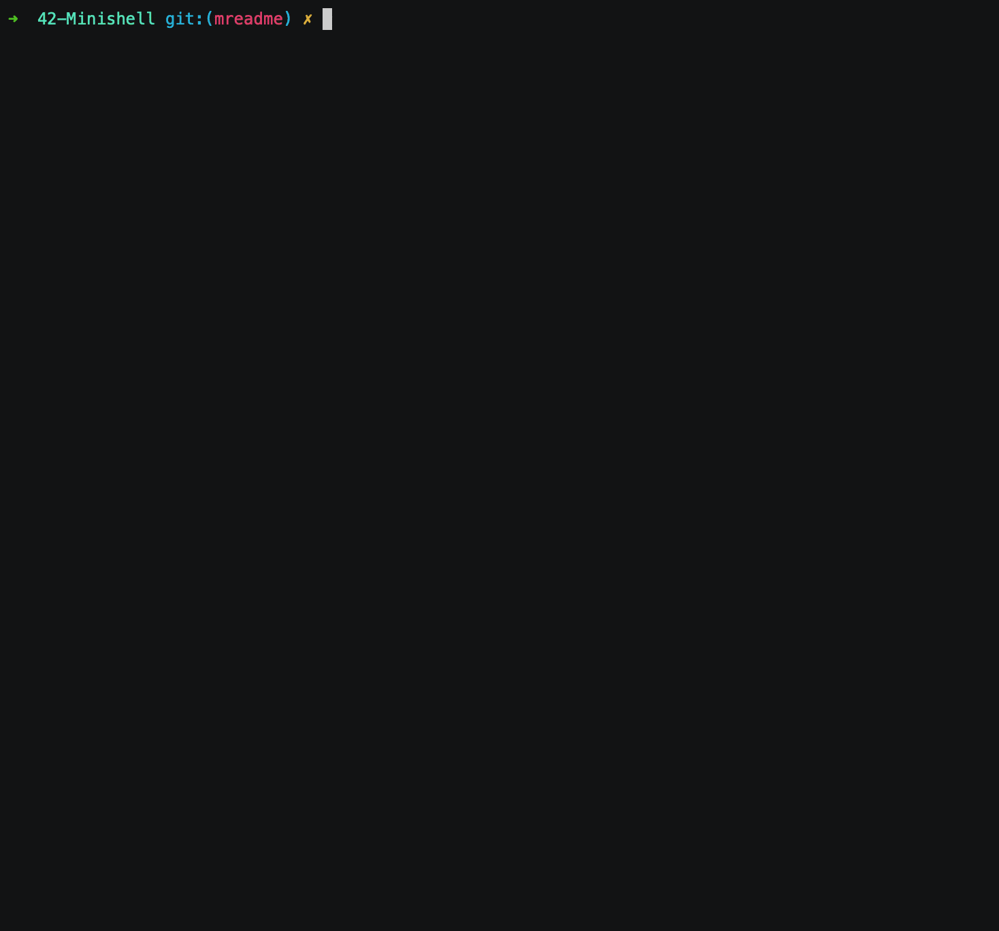

# Minishell

First step in the creation of a shell. This project consists in a mini-shell capable of reading and evaluating simple user commands. Trivial lexical analysis and parsing of the command. Searching for the corresponding binary on the machine and execute it, or execute the relevant code in the case of a “built-in” command in the shell.

## 1. Project Partners

------

- [Marc Jose](https://github.com/mjose-portfolio)

## 2. Install
------

- `make`



### 2.1. Make Options

- `make`: Compiles the files and creates the executable `minishell`
- `make clean`: Remove binary files.
- `make fclean`: Deletes the binary files and the `minishell` executable file.
- `make re`: Deletes the binary files and the `minishell` executable file and recompiles them.

## 3. Features
------
### 3.1 Builtins

- [3.1.1 cd](./builtins#311-cd)
- [3.1.2 echo](./builtins#312-echo)
- [3.1.3 env](./builtins#313-env)
- [3.1.4 exit](./builtins#314-exit--n-)
- [3.1.5 setenv](./builtins#315-setenv)
- [3.1.6 unsetenv](./builtins#316-unsetenv)

### 3.2 Prompt

The prompt is displayed as follows:

- `["shell name"] :: "current directory" ->`

The current directory is updated live, each time you change directory, of course, the information is collected from the environment variable `PWD`.

### 3.3 Execution of Commands

The command shall be searched for using the PATH environment variable.

It is possible to specify the paths where the command to execute resides (in case you want to execute a command that does not reside in any directory of the PATH variable, or the variable is not defined).

The parameters of each command are taken into account.

### 3.4 Management Of Internal Variables

- List the internal variables of the shell via the built-in [env](./builtins#313-env).
- Removal of internal and environmental variables, via the built-in [unsetenv](./builtins#316-unsetenv).
- Creation of environment variables for a single command via the built-in [setenv](./builtins#316-setenv).

### 3.5 Parameter Expansions

```
~
```

**HOME path of the current user.** Is replaced by the HOME path of the current user.

